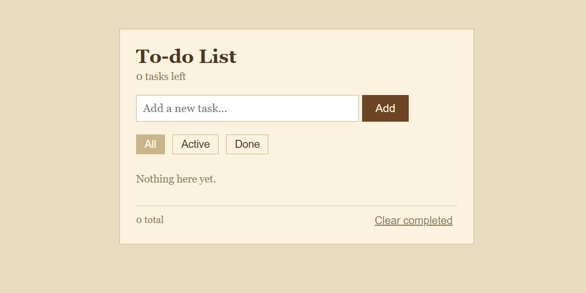

# To-Do List

## 🚀 Overview

A simple and responsive **To-Do List web application** built using **HTML, CSS, and JavaScript**. It allows users to add, complete, filter, and delete tasks while automatically saving tasks using **Local Storage**.

## 🔍 Features

* ➕ **Add Tasks:** Create new tasks through the input form.
* ✅ **Complete Tasks:** Mark tasks as completed or active.
* 🔎 **Task Filtering:** View **All**, **Active**, or **Done** tasks.
* 🗑️ **Delete Tasks:** Remove individual tasks from the list.
* 🧹 **Clear Completed:** Remove all completed tasks at once.
* 💾 **Local Storage:** Tasks remain saved even after refreshing the page.
* 🔢 **Task Counter:** Displays the number of remaining and total tasks.
* 📱 **Responsive Design:** Works across different screen sizes.

## 🛠️ Technologies Used

* **HTML** – Structure of the application
* **CSS** – Styling, layout, and responsive design
* **JavaScript** – DOM manipulation, task management, filtering, and Local Storage

## ⚙️ How It Works

1. Enter a task in the input field.
2. Click **Add** to add it to the list.
3. Mark tasks as completed when finished.
4. Use the **All, Active, and Done** tabs to filter tasks.
5. Delete individual tasks or clear all completed tasks.
6. Tasks are automatically stored in **Local Storage**.

## 📸 Screenshot



## 📂 Project Structure

```text
To-do/
│
├── index.html
├── style.css
└── script.js
```

## 🏃‍♀️ How to Run

1. Clone the repository:

   ```bash
   git clone https://github.com/LeosThrone/todoApp.git
   ```

2. Open the project folder.

3. Open `index.html` in your browser.
